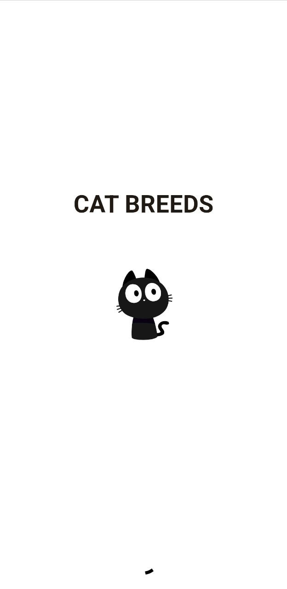
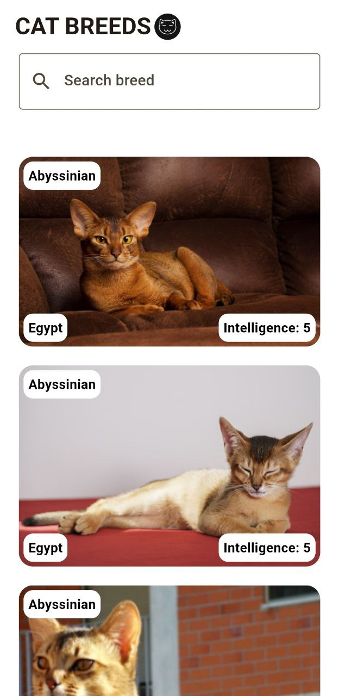
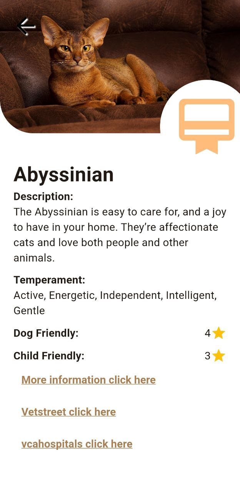

# 🐱 Cat Breeds App

Cat Breeds App es una aplicación desarrollada en Flutter que permite explorar diferentes razas de gatos, aplicar filtros y ver detalles de cada una de ellas. 🐾

## 🚀 Tecnologías utilizadas

- **Flutter** (3.24.2) 🏗️  
- **Arquitectura Limpia (Clean Architecture)** 📂  
- **Provider** para la gestión de estado 🎛️  

## ⚙️ Configuración de entorno

Para ejecutar la aplicación con las variables de entorno configuradas, usa el siguiente comando:

```sh
flutter run -t lib/main.dart \
  --dart-define=API_URL=<Url-Api>\
  --dart-define=AUTH_TOKEN=dev_12345
```

Para generar el APK:

```sh
flutter build apk -t lib/main.dart \
  --dart-define=API_URL=<Url-Api>\
  --dart-define=AUTH_TOKEN=<token>
```

## 📸 Capturas de pantalla

  
  
  

---
✨ ¡Explora, filtra y descubre todo sobre las razas de gatos con esta app! 🐾

